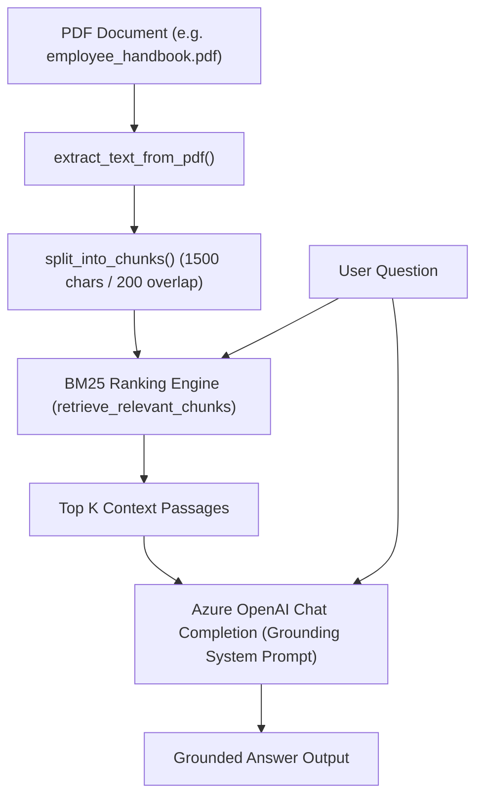

# 📄 Document Q&A Bot (RAG with Azure OpenAI)

A high-performance **Retrieval-Augmented Generation (RAG)** Document Question & Answering Bot built in Python. It extracts content from PDF documents, indexes text into overlapping chunks, applies **BM25 Lexical Ranking** to retrieve the most relevant sections, and generates strictly grounded answers using **Azure OpenAI**.

---

## 🌟 Key Features

- **📑 PDF Text Ingestion**: Seamlessly extracts text across multi-page PDF documents using `pypdf`.
- **✂️ Overlapping Chunking**: Splits large documents into overlapping windows (1,500 characters with 200-character overlap) to preserve contextual boundaries.
- **🔍 BM25 Ranking Retrieval**: Employs BM25 TF-IDF scoring to rank and retrieve top-k document passages with support for alphanumeric terms, codes, and section numbers.
- **🧠 Grounded Answers with Azure OpenAI**: Utilizes Azure OpenAI (`gpt-5-mini` / `gpt-4o`) with strict anti-hallucination prompting to ensure responses rely only on the document context.
- **💬 Interactive Terminal CLI**: User-friendly interactive loop allowing multiple questions in a single session without reloading the document.

---

## 🏗️ Architecture & Workflow



1. **Extraction**: `extract_text_from_pdf()` extracts raw text from all pages.
2. **Chunking**: `split_into_chunks()` breaks the text into overlapping segments.
3. **Retrieval**: `retrieve_relevant_chunks()` scores document chunks using BM25 ranking based on query tokens.
4. **Generation**: `generate_answer()` passes the top matching chunks and the user's question to Azure OpenAI, enforcing zero external assumptions and no hallucinated facts.

---

## 📁 Project Structure

```text
Document_QA_Bot/
├── documents/
│   └── employee_handbook.pdf    # Target PDF document
├── src/
│   ├── document_processor.py   # PDF text extraction & sliding-window chunking
│   ├── qa_agent.py             # BM25 retrieval engine & Azure OpenAI client
│   ├── prompts.py              # Custom prompts (optional extension)
│   └── main.py                 # Interactive CLI entry point
├── .env.example                # Template for environment variables
├── .gitignore                  # Git ignore configuration
├── requirements.txt            # Python dependencies
└── README.md                   # Project documentation
```

---

## 🚀 Getting Started

### Prerequisites

- Python 3.10+ installed
- Active Azure OpenAI resource with a deployed model (e.g., `gpt-5-mini`, `gpt-4o`, etc.)

---

### 1. Clone the Repository

```bash
git clone https://github.com/veeranagouda961/Document_QA_Bot.git
cd Document_QA_Bot
```

---

### 2. Create and Activate a Virtual Environment

**On Windows (PowerShell):**
```powershell
python -m venv .venv
.\.venv\Scripts\Activate.ps1
```

**On Windows (Command Prompt):**
```cmd
python -m venv .venv
.\.venv\Scripts\activate.bat
```

**On Linux / macOS:**
```bash
python3 -m venv .venv
source .venv/bin/activate
```

---

### 3. Install Dependencies

```bash
pip install -r requirements.txt
```

---

### 4. Configure Environment Variables

Create a `.env` file in the root directory by copying `.env.example`:

```bash
cp .env.example .env
```

Edit `.env` and fill in your Azure OpenAI credentials:

```ini
AZURE_OPENAI_ENDPOINT=https://<your-resource-name>.cognitiveservices.azure.com/
AZURE_OPENAI_API_KEY=your_azure_openai_api_key_here
AZURE_OPENAI_DEPLOYMENT=gpt-5-mini
AZURE_OPENAI_API_VERSION=2024-12-01-preview
```

---

## 💻 Usage

Run the main application:

```bash
python src/main.py
```

### Example Session

```text
==========================================
          DOCUMENT Q&A BOT
==========================================
Loaded File        : documents/employee_handbook.pdf
Document Characters: 8554
Document Chunks    : 7
==========================================
Tip: Type 'exit' or 'q' to quit.
==========================================

Ask a question about the document (or 'exit' to quit): What is the policy for Category A documents?

Generating answer using Azure OpenAI...

========== ANSWER ==========

Category A documents are temporary in nature and must be preserved for a period not less than 8 years (or such other period as may be prescribed under law); thereafter they may be destroyed. Records destroyed must be entered in a register of destroyed documents (entries authenticated by the Department Head), and disposal particulars are to be maintained in the disposal register with the Compliance Officer.

============================

Ask a question about the document (or 'exit' to quit): quit
Exiting Document Q&A Bot. Goodbye!
```

---

## 🔒 Security & Best Practices

- **Never commit `.env`**: Secrets and API keys are ignored via `.gitignore`.
- **Zero Hallucination Tolerance**: The system prompt strictly disallows external knowledge and assumptions. If the document lacks relevant information, it explicitly informs the user.

---

## 📄 License

This project is open-source 
